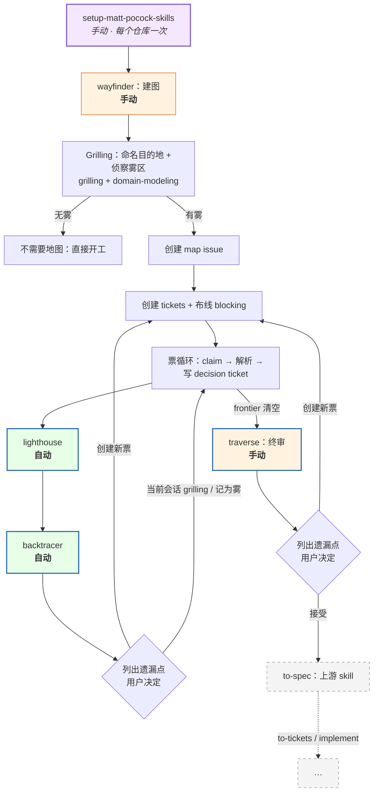
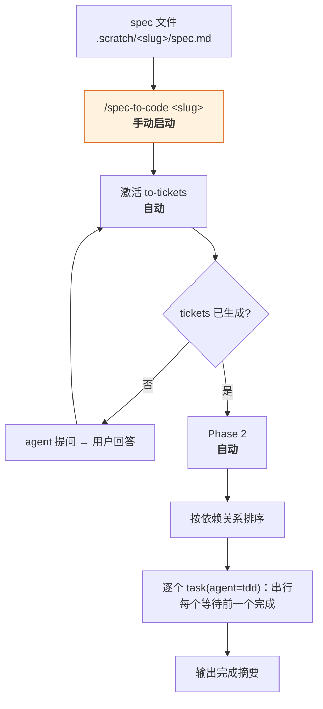

# Oh My Wayfinder

[English](./README.md)

**[mattpocock/skills](https://github.com/mattpocock/skills) 的 fork**：为 AI 编程 agent 设计的工程技能集。本仓库在其基础上新增了规划质检类 skill，并为 **[Oh My Pi](https://github.com/can1357/oh-my-pi)** agent 编写了自动化扩展。

本仓库改造上游的四个 skill（`wayfinder`、`setup-matt-pocock-skills`、`to-tickets`、`ask-matt`），并以**完整目录**形式发布（无需改动的文件逐字取自上游），另加新增的 `lighthouse` / `backtracer` / `traverse` 与 Oh My Pi 扩展。请先安装 Matt 的技能集，再把本仓库的文件覆盖上去（见 [快速开始](#快速开始)）。

## 快速开始

> 开始之前，请确保你已经理解 wayfinder 的流程：本仓库的一切都建立在它之上（见 [流程图 A](#流程图-awayfinder-规划管线)）。

本仓库是 Matt 技能集之上的增量，所以：先装上游，再覆盖。

1. 安装 Matt 的技能集：`npx skills@latest add mattpocock/skills`。
2. 把本仓库的 `skills/` 目录复制并覆盖到已安装的 skill 目录：同名文件自动替换上游版本，其余文件为纯新增。
3. Oh My Pi 用户：把 `extensions/spec-to-code.ts` 和 `extensions/agents/tdd.md` 放入扩展位置（扩展会自动发现同目录下的 `tdd` agent）。

然后与上游一致，每个仓库运行一次 `/setup-matt-pocock-skills`。

## 仓库内容

**第一部分：通用 skills**（与 agent 无关，任何支持 markdown skill 的 agent 均可使用）

它们驱动的规划循环：`wayfinder` 把一次超出单个会话的工作量绘制成 issue tracker 上的决策票地图；每张票解决后由 **lighthouse** 固化为文档；**backtracer** 在地图上追踪信号、暴露缺口；**traverse** 在地图完成后做端到端终审，然后交给 `to-spec`。

**第二部分：[Oh My Pi](https://github.com/can1357/oh-my-pi) 自动化扩展**（仅 `@oh-my-pi/pi-coding-agent`）

`/spec-to-code` 把一份 spec 自动切分为实现票，并用串行 TDD 子代理逐个实现。一条命令，全流程自动。使用其他 agent 的读者可以完全忽略这部分。

## 相比上游新增了什么

| 技能 | 类型 | 作用 | 何时调用 | 触发方式 |
|---|---|---|---|---|
| `lighthouse` | **新增** | 把已解决的 wayfinder 票固化为灯塔文档：决策、用户故事、前置条件、后置条件、不变量，是 backtracer 追踪的信号源 | 每张 wayfinder 票解决后立即执行 | **自动**（由 wayfinder 调用） |
| `backtracer` | **新增** | 把票与灯塔文档中的 "so that" 子句、不变量、依赖信号回溯到整张地图，在缺口变成 bug 之前暴露缺失票、层次缺口与不对称 | lighthouse 之后，每张已解决票执行一次 | **自动**（由 wayfinder 调用） |
| `traverse` | **新增** | 已完成地图的终审：构建设计树并走查每条分支，检查依赖覆盖、同级对称、层次完整、边界完备 | 所有 wayfinder 票解决后、进入 to-spec 之前 | **手动** |
| `wayfinder` | **改造** | 上游 skill 的重构版：每张票解决后强制 lighthouse + backtracer，区分决策票（`.scratch/<feature>/decision/`）与实现票（`.scratch/<feature>/implementation/`），缺口决策交由用户拍板 | 当工作量超出单个 agent 会话时 | **手动** |
| `setup-matt-pocock-skills` | **改造** | 上游设置 skill，轻量适配（issue tracker 选项、triage 标签、domain 文档布局） | 每个仓库一次，首次使用前 | **手动** |
| `to-tickets` | **改造** | 上游 skill：本地 tracker 的输出去向改为 `.scratch/<feature>/implementation/` | 把 spec 或计划拆成票时 | **手动** |
| `ask-matt` | **改造** | 路由文本：本地 tracker 路径改为 `.scratch/<feature>/implementation/` | 询问该用哪个 skill 时 | **手动** |
| `spec-to-code` + `tdd` agent | **扩展**（仅 OMP） | Spec → 实现票 → 串行 TDD 子代理，一条命令后全自动 | 有规格文档并希望实现它时 | **手动启动**，之后全自动 |

「自动」指调用方 skill 在流程中强制触发该步骤，是 skill 指令层面的保证，而非独立的调度器。

## 暂不支持 GitHub / GitLab tracker

管线中「自动」的那部分（每张票解决后强制 lighthouse + backtracer）目前只针对**本地 markdown tracker**（`.scratch/<feature>/decision/` 用于规划、`.scratch/<feature>/implementation/` 用于实现票）设计。GitHub 与 GitLab 的 tracker 配置原样来自上游，描述的仍是上游原本的 resolve 步骤，因此这两种场景暂不支持。

这是有意留到后续的步骤，不是遗漏。

**本地目录改名（对本地 tracker 是破坏性变更）**：实现票从 `.scratch/<feature>/issues/` 移到 `.scratch/<feature>/implementation/`，术语也从「任务票」改为「实现票」；已配置过的仓库不会被自动迁移。

## 流程图 A：wayfinder 规划管线



- 整条管线只有两个手动触发点：`wayfinder` 本身和 `traverse`（终审）。
- `lighthouse` 与 `backtracer` 由 wayfinder 在每张票解决后自动调用。
- `backtracer`（逐票）与 `traverse`（收尾）之后，skill 会列出它发现的遗漏点。skill 文件本身不规定如何处理：由用户决定。建议的处理方式：创建新票、就在当前会话用 grilling 消化、或记入地图的 **Not yet specified**（雾区）。
- 管线在 `to-spec` 处交接给上游。`implement` 属于 mattpocock/skills；本仓库 vendoring `to-tickets` 与 `ask-matt` 仅用于修改本地票目录。

颜色图例：蓝色粗边框 = 本仓库新增的 skill · 绿色 = 自动调用 · 橙色 = 手动触发 · 紫色 = 一次性 setup · 灰色虚线 = 上游 / 本仓库之外。

## 流程图 B：`/spec-to-code`：spec 到代码（仅 Oh My Pi）

spec 位于 `.scratch/<slug>/spec.md`（由 `/to-spec` 发布），运行 `/spec-to-code <slug>`。这一条命令是唯一的手动步骤。之后全部自动运行。



`tdd` agent（`extensions/agents/tdd.md`）是本仓库为这条流程新增的唯一部分。`to-tickets` 与 `tdd` skill 本身来自上游。前置条件（`to-tickets` skill、`tdd` skill 或 `tdd` agent）由扩展自动检查、立即报错，无需手动确认。

## 源文件与构建

四个被改造的 skill 以完整目录发布，与上游的差异以数据形式保存：

- `upstream/`：整目录拷贝进来的四个上游 skill 目录；里面多出来的文件（例如 `agents/openai.yaml`）无所谓，构建会忽略它们。
- `deltas/manifest.json` 只保留 `files` 白名单，列出本仓库为这四个 skill 发布的全部九个文件。只有列表中的文件会从 `upstream/` 读取并写入 `skills/`；这两个 `skills/<skill>/` 目录下的其他文件会被构建删除。
- [deltas/wayfinder.md](deltas/wayfinder.md)、[deltas/setup-matt-pocock-skills.md](deltas/setup-matt-pocock-skills.md)、[deltas/to-tickets.md](deltas/to-tickets.md) 与 [deltas/ask-matt.md](deltas/ask-matt.md) 同时是映射源文件和人类审核入口。每项映射把目标、ID、理由和 diff 放在一起；白名单中没有映射的文件原样继承。
- `skills/`：安装产物。`lighthouse`、`backtracer`、`traverse` 为手写；manifest 里列出的九个文件为生成物，**不要手工编辑**。

直接在两份 Markdown 文档中编辑映射：

- 文档以 `# <skill>` 开头，用 `## <skill>/<file>` 指定有改动且位于白名单内的目标，用 `### <op-id>` 标识映射。ID 使用小写 kebab-case，在同一 skill 内唯一。每项映射包含简短理由和恰好一个反引号围栏的 `diff` 块。
- 每行第一个字符为 `-`（原文）、`+`（替换文本）或空格（两者共有）。还原文本时只移除这一个字符，其余空白原样保留；空行也必须带标记。使用 LF 换行并保留文件末尾换行。如果 diff 内含 Markdown 代码围栏，使用更长且前后匹配的反引号围栏。
- 每个块表达一次连续替换，纯插入必须带已有上下文。这是项目内的精简 diff 格式，没有文件头或 `@@` 行号，不是供 `git apply` 使用的补丁。
- 同一目标内按文档顺序执行映射，后项处理前项修改后的文本。还原出的原文必须恰好出现一次；定位缺失或有歧义、没有实际改动及格式损坏都会导致构建失败。

```bash
node deltas/build.mjs          # 重新生成 skills/ 下被列出的文件
node deltas/build.mjs --check  # 校验它们与 upstream/ + deltas/ 一致
```

更新上游快照是手动操作、不涉及 git：把较新上游 checkout 里的 `wayfinder/`、`setup-matt-pocock-skills/`、`to-tickets/` 与 `ask-matt/` 整个目录覆盖到 `upstream/` 下的同名路径，然后运行 `node deltas/build.mjs`，提交前检查 `skills/` 的变化。当上游改写了某个 op 依赖的文本时，构建会大声失败并指出该 op；列表中的文件若被上游删除，构建同样会失败。

## 致谢

本仓库的核心是 **[mattpocock/skills](https://github.com/mattpocock/skills)**。感谢 Matt Pocock 构建并以 MIT 协议开源这套技能，也感谢 [skills.sh](https://skills.sh/mattpocock/skills) 安装器与[新闻通讯](https://www.aihero.dev/s/skills-newsletter)让整个生态持续运转。同时感谢 [Oh My Pi](https://github.com/can1357/oh-my-pi) 项目，本扩展所服务的 agent 平台。

## License

MIT，见 [LICENSE](./LICENSE)。上游版权声明原样保留：*Copyright (c) 2026 Matt Pocock*。
