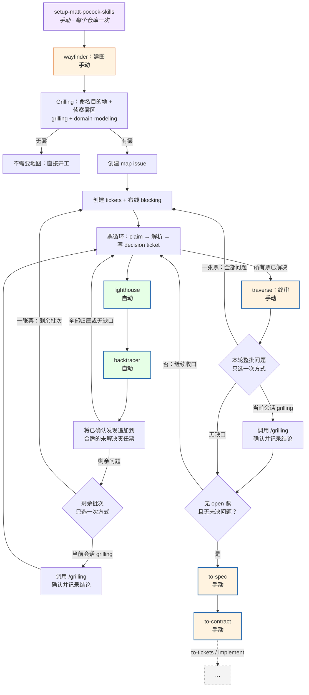
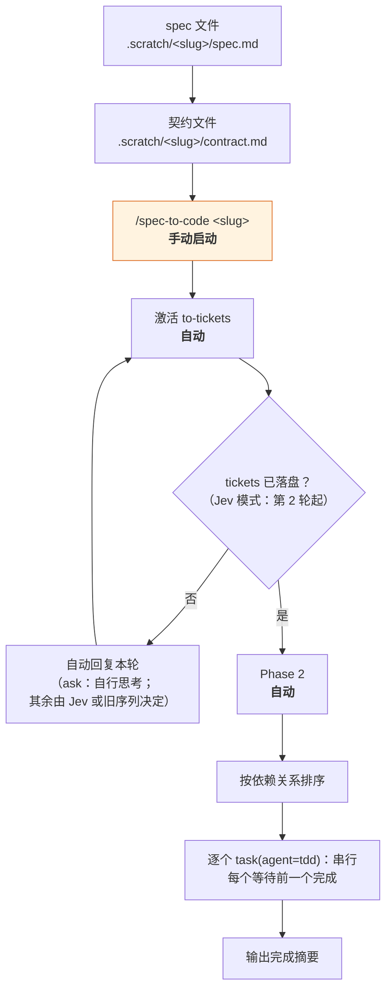

# Oh My Wayfinder

[English](./README.md)

**[mattpocock/skills](https://github.com/mattpocock/skills) 的 fork**：为 AI 编程 agent 设计的工程技能集。本仓库在其基础上新增了规划质检类 skill，并为 **[Oh My Pi](https://github.com/can1357/oh-my-pi)** agent 编写了自动化扩展。

本仓库改造上游的八个 skill（`wayfinder`、`setup-matt-pocock-skills`、`to-spec`、`to-tickets`、`ask-matt`、`prototype`、`code-review`、`tdd`），并以**完整目录**形式发布（无需改动的文件逐字取自上游），另加新增的 `lighthouse` / `backtracer` / `traverse` / `to-contract` 与 Oh My Pi 扩展。请先安装 Matt 的技能集，再把本仓库的文件覆盖上去（见 [快速开始](#快速开始)）。

## 快速开始

> 开始之前，请确保你已经理解 wayfinder 的流程：本仓库的一切都建立在它之上（见 [流程图 A](#流程图-awayfinder-规划管线)）。

本仓库是 Matt 技能集之上的增量，所以：先装上游，再覆盖。

1. 安装 Matt 的技能集：`npx skills@latest add mattpocock/skills`。
2. 把本仓库的 `skills/` 目录复制并覆盖到已安装的 skill 目录：同名文件自动替换上游版本，其余文件为纯新增。
3. Oh My Pi 用户：把 `extensions/spec-to-code.ts` 和 `extensions/agents/tdd.md` 放入扩展位置（扩展会自动发现同目录下的 `tdd` agent）。

然后与上游一致，每个仓库运行一次 `/setup-matt-pocock-skills`。

## 仓库内容

**第一部分：通用 skills**（与 agent 无关，任何支持 markdown skill 的 agent 均可使用）

它们驱动的规划循环：`wayfinder` 把一次超出单个会话的工作量绘制成 issue tracker 上的决策票地图；每张票解决后由 **lighthouse** 固化为文档；**backtracer** 在地图上追踪信号、暴露缺口；**traverse** 在地图完成后做端到端终审，然后交给 `to-spec`；`to-spec` 产出 spec 后，`to-contract` 把它变成已批准的契约（承诺清单，以及观察这些承诺的 seam），`to-tickets` 再据此切片。

**第二部分：[Oh My Pi](https://github.com/can1357/oh-my-pi) 自动化扩展**（仅 `@oh-my-pi/pi-coding-agent`）

`/spec-to-code` 把一份 spec 自动切分为实现票，并用串行 TDD 子代理逐个实现。一条命令，全流程自动。使用其他 agent 的读者可以完全忽略这部分。

## 相比上游新增了什么

| 技能 | 类型 | 作用 | 何时调用 | 触发方式 |
|---|---|---|---|---|
| `lighthouse` | **新增** | 把已解决的 wayfinder 票固化为灯塔文档：决策、用户故事、前置条件、后置条件、不变量，是 backtracer 追踪的信号源 | 每张 wayfinder 票解决后立即执行 | **自动**（由 wayfinder 调用） |
| `backtracer` | **新增** | 把票与灯塔文档中的 "so that" 子句、不变量、依赖信号回溯到整张地图，在缺口变成 bug 之前暴露缺失票、层次缺口与不对称 | lighthouse 之后，每张已解决票执行一次 | **自动**（由 wayfinder 调用） |
| `traverse` | **新增** | 已完成地图的终审：构建设计树并走查每条分支，检查依赖覆盖、同级对称、层次完整、边界完备 | 所有 wayfinder 票解决后、进入 to-spec 之前 | **手动** |
| `to-contract` | **新增** | 把 spec 变成已批准的契约：承诺清单与轻量测试 seam 草图，优先沿用既有 seam；重大 interface 重设计先获用户授权。写入 `.scratch/<feature>/contract.md` | 介于 to-spec 与 to-tickets 之间 | **手动** |
| `wayfinder` | **改造** | 上游 skill 的重构版：每张票解决后强制 lighthouse + backtracer，区分决策票（`.scratch/<feature>/decision/`）与实现票（`.scratch/<feature>/implementation/`），缺口决策交由用户拍板 | 当工作量超出单个 agent 会话时 | **手动** |
| `setup-matt-pocock-skills` | **改造** | 上游设置 skill，轻量适配（issue tracker 选项、triage 标签、domain 文档布局） | 每个仓库一次，首次使用前 | **手动** |
| `to-spec` | **改造** | 上游 skill 的重构版：seam 草图与 Testing Decisions 中的 seam 部分移交给 `to-contract`；发布 spec 后指向 `/to-contract` 作为下一步 | 把当前对话变成 spec 时 | **手动** |
| `to-tickets` | **改造** | 上游 skill 的重构版：本地 tracker 的输出去向改为 `.scratch/<feature>/implementation/`，且必须输入已批准契约；票要声明 `Delivers`（或 enabling），quiz 增加覆盖度提问 | 把契约拆成票时 | **手动** |
| `ask-matt` | **改造** | 路由文本：本地 tracker 路径改为 `.scratch/<feature>/implementation/`，并补充新增 skill 的说明与原有流程的改动 | 询问该用哪个 skill 时 | **手动** |
| `prototype` | **改造** | 上游 skill 的重构版：问题回答完后交回一个 `prototype/<name>` worktree（内含所选结果与 `VERDICT.md`），并还原工作区；不再写 spec、issue 或 ticket | 用一次性代码回答一个设计问题时 | **手动** |
| `code-review` | **改造** | 上游 skill 的重构版：默认 review 目标改为相对 `HEAD` 的未提交改动（含未跟踪文件、遵守 `.gitignore`）；传入固定点仍 review 已提交区间 | review 进行中的工作、分支或 PR 时 | **手动** |
| `tdd` | **改造** | 上游 skill 的重构版：执行改为票驱动 —— 验收标准、覆盖归属与已批准 seam 来自被指派的工作 —— 循环新增 design-before-red、preserve-the-criterion、check-the-evidence 规则，并加上完成条件 | 以测试先行方式实现功能或修 bug 时 | **手动** |
| `spec-to-code` + `tdd` agent | **扩展**（仅 OMP） | Spec → 实现票 → 串行 TDD 子代理，一条命令后全自动；可选 Jev 驱动回合回复 | 有规格文档并希望实现它时 | **手动启动**，之后全自动 |

「自动」指调用方 skill 在流程中强制触发该步骤，是 skill 指令层面的保证，而非独立的调度器。

## 暂不支持 GitHub / GitLab tracker

管线中「自动」的那部分（每张票解决后强制 lighthouse + backtracer）目前只针对**本地 markdown tracker**（`.scratch/<feature>/decision/` 用于规划、`.scratch/<feature>/implementation/` 用于实现票）设计。GitHub 与 GitLab 的 tracker 配置原样来自上游，描述的仍是上游原本的 resolve 步骤，因此这两种场景暂不支持。

这是有意留到后续的步骤，不是遗漏。

**本地目录改名（对本地 tracker 是破坏性变更）**：实现票从 `.scratch/<feature>/issues/` 移到 `.scratch/<feature>/implementation/`，术语也从「任务票」改为「实现票」；已配置过的仓库不会被自动迁移。

**决策票生命周期**：本地决策票仅使用 `open → claimed → resolved`，`Type:` 仍表示处理方式。`resolved` 表示决策或经确认的范围外处置已记录，与生产实现是否交付无关；研究与原型代码可以作为证据。Triage 仅用于实现票。范围外处置记入地图的 **Out of scope**，不进入 **Decisions so far**；推进 frontier 前必须检查依赖，因为处置完成不等于原问题已获解答。

已有项目的 tracker 文档不会自动更新。请按新版 setup 模板调整决策票状态与阻塞判定；旧的 triage 状态决策票需要逐张确认含义，不应机械转换为 `resolved`。

## 流程图 A：wayfinder 规划管线


```mermaid
flowchart TD
    S["setup-matt-pocock-skills<br/><i>手动 · 每个仓库一次</i>"] --> W["wayfinder：建图<br/><b>手动</b>"]
    W --> G["Grilling：命名目的地 +<br/>侦察雾区<br/>grilling + domain-modeling"]
    G -->|"无雾"| N["不需要地图：直接开工"]
    G -->|"有雾"| M["创建 map issue"]
    M --> T["创建 tickets + 布线 blocking"]
    T --> L["票循环：claim → 解析 →<br/>写 decision ticket"]
    L --> LH["lighthouse<br/><b>自动</b>"]
    LH --> BT["backtracer<br/><b>自动</b>"]
    BT --> OWN["将已确认发现追加到<br/>合适的未解决责任票"]
    OWN -->|"剩余问题"| CG{"剩余批次<br/>只选一次方式"}
    OWN -->|"全部归属或无缺口"| L
    CG -->|"一张票：剩余批次"| T
    CG -->|"当前会话 grilling"| BG["调用 /grilling<br/>确认并记录结论"]
    BG --> L
    L -->|"所有票已解决"| TR["traverse：终审<br/><b>手动</b>"]
    TR --> CG2{"本轮整批问题<br/>只选一次方式"}
    CG2 -->|"一张票：全部问题"| T
    CG2 -->|"当前会话 grilling"| TG["调用 /grilling<br/>确认并记录结论"]
    TG --> R{"无 open 票<br/>且无未决问题？"}
    R -->|"是"| TS["to-spec<br/><b>手动</b>"]
    R -->|"否：继续收口"| L
    CG2 -->|"无缺口"| R
    TS --> TC["to-contract<br/><b>手动</b>"]
    TC -.->|"to-tickets / implement"| X["…"]

    style LH fill:#e6ffe6,stroke:#2b6cb0,stroke-width:2px
    style BT fill:#e6ffe6,stroke:#2b6cb0,stroke-width:2px
    style TR fill:#fff3e0,stroke:#2b6cb0,stroke-width:2px
    style W fill:#fff3e0,stroke:#dd6b20
    style S fill:#f3e8ff,stroke:#805ad5,stroke-width:2px
    style TS fill:#fff3e0,stroke:#2b6cb0,stroke-width:2px
    style TC fill:#fff3e0,stroke:#2b6cb0,stroke-width:2px
    style X fill:#f4f4f4,stroke:#999,stroke-dasharray:5 5
```

- wayfinder 循环内只有两个手动触发点：`wayfinder` 本身和 `traverse`（终审）；其后的交接 `to-spec` → `to-contract` 同样是手动。
- `lighthouse` 与 `backtracer` 由 wayfinder 在每张票解决后自动调用。
- `backtracer` 先将已确认发现追加到决策范围匹配的既有未解决票，保留证据，并区分已决定约束与待决问题。归属是交接，不是解决。只有剩余无归属问题进入[共享后续处理协议](skills/backtracer/GAP-FOLLOWUP.md)；`traverse` 在所有票解决后运行，直接传入终审的未决问题批次。用户对传入批次只选一次方式：**当前会话 grilling** 直接加载并执行 `/grilling`；**生成一张 ticket** 把全部问题及证据收进一张 open 的 grilling 决策票，关联地图并布线，不立即开始讨论。当前会话的结论确认后更新已有 decision/lighthouse 文档及地图；明确延期的问题记入 **Not yet specified**。traverse 终审收尾时，新增票未解决或仍有未决雾区就返回规划，而不进入 `/to-spec`。
- 管线依次交给 `to-spec` 与 `to-contract`，两者都由本仓库发布。`implement` 属于 mattpocock/skills；本仓库 vendoring `to-tickets` 与 `ask-matt`（本地票目录改名 + 契约门）。

颜色图例：蓝色粗边框 = 本仓库新增的 skill · 绿色 = 自动调用 · 橙色 = 手动触发 · 紫色 = 一次性 setup · 灰色虚线 = 上游 / 本仓库之外。

## 流程图 B：`/spec-to-code`：spec 到代码（仅 Oh My Pi）

spec 位于 `.scratch/<slug>/spec.md`（由 `/to-spec` 发布）、已批准契约位于 `.scratch/<slug>/contract.md`（由 `/to-contract` 写入；Phase 1 的 `to-tickets` 强制要求它），运行 `/spec-to-code <slug>`。这一条命令是唯一的手动步骤。之后全部自动运行。在 `to-tickets` 阶段，agent 的 `ask` 会被自动代答为「请你仔细思考后回答这个问题」，不再等待人工输入；每次回合结束发送一条自动回复。默认走旧的原生序列（先「请你仔细思考后回答这些问题」，之后「请生成文件」）；在 `extensions/spec-to-code/config.json` 里开启 `jev.enabled: true` 后，扩展改问 `judge` 角色链（优先 TypeSafe Jev）决定回复 —— 第一轮只提供「请你仔细思考后回答这些问题」/「请生成文件」，第二轮起加入「请继续」。Jev 模式下第二轮起，ticket 一旦落盘就直接结束 Phase 1、不再请求 Jev，已发布的票不会被反复催促。每次自动代答或自动续跑都会消耗一个有界预算（15 次），用尽后停止该阶段并给出通知，而不是无限循环；但若 ticket 文件已生成，则直接进入 Phase 2。

```jsonc
// extensions/spec-to-code/config.json —— 扩展加载时读取一次
{
  "jev": {
    "enabled": false          // 可选开启；需要有凭证的原生 judge（如 typesafe/jev-latest）
  }
}
```


```mermaid
flowchart TD
    P["spec 文件<br/>.scratch/&lt;slug&gt;/spec.md"] --> CT["契约文件<br/>.scratch/&lt;slug&gt;/contract.md"]
    CT --> C["/spec-to-code &lt;slug&gt;<br/><b>手动启动</b>"]
    C --> A["激活 to-tickets<br/><b>自动</b>"]
    A --> Q{"tickets 已落盘？<br/>（Jev 模式：第 2 轮起）"}
    Q -->|"否"| QA["自动回复本轮<br/>（ask：自行思考；<br/>其余由 Jev 或旧序列决定）"] --> A
    Q -->|"是"| P2["Phase 2<br/><b>自动</b>"]
    P2 --> ORD["按依赖关系排序"]
    ORD --> TD["逐个 task(agent=tdd)：串行<br/>每个等待前一个完成"]
    TD --> DONE["输出完成摘要"]

    style C fill:#fff3e0,stroke:#dd6b20
```

`tdd` agent（`extensions/agents/tdd.md`）是本仓库为这条流程新增的唯一部分。`to-tickets` 与 `tdd` 两个 skill 来自上游、在本仓库被改造：`to-tickets` 强制要求契约，`tdd` 则从被指派的工作中取得验收标准、覆盖 ID 与 seam。前置条件（`to-tickets` skill、`tdd` skill 或 `tdd` agent）由扩展自动检查、立即报错，无需手动确认。

## 源文件与构建

八个被改造的 skill 以完整目录发布，与上游的差异以数据形式保存：

- `upstream/`：整目录拷贝进来的八个上游 skill 目录；里面多出来的文件（例如 `agents/openai.yaml`）无所谓，构建会忽略它们。
- `deltas/manifest.json` 只保留 `files` 白名单，列出本仓库为这八个 skill 发布的全部十七个文件。只有列表中的文件会从 `upstream/` 读取并写入 `skills/`；这两个 `skills/<skill>/` 目录下的其他文件会被构建删除。
- [deltas/mappings/wayfinder.md](deltas/mappings/wayfinder.md)、[deltas/mappings/setup-matt-pocock-skills.md](deltas/mappings/setup-matt-pocock-skills.md)、[deltas/mappings/to-spec.md](deltas/mappings/to-spec.md)、[deltas/mappings/to-tickets.md](deltas/mappings/to-tickets.md)、[deltas/mappings/ask-matt.md](deltas/mappings/ask-matt.md)、[deltas/mappings/prototype.md](deltas/mappings/prototype.md)、[deltas/mappings/code-review.md](deltas/mappings/code-review.md)、[deltas/mappings/tdd.md](deltas/mappings/tdd.md) 同时是映射源文件和人类审核入口。每个 op 把目标、ID、理由和编辑放在一起；白名单中没有映射的文件原样继承。
- `skills/`：安装产物。`lighthouse`、`backtracer`、`traverse`、`to-contract` 为手写；manifest 里列出的十七个文件为生成物，**不要手工编辑**。

票规则按职责维护：wayfinder 定义决策生命周期与完成分支；本地 tracker 模板定义存储和字段，完成步骤指回 wayfinder；triage 模板只维护实现票词汇。范围外处置必须完成依赖检查后再回到主流程，每张已解决票只调用一次 backtracer。

[wayfinder mappings](deltas/mappings/wayfinder.md) 中的完成 hooks：[lighthouse-on-resolution](deltas/mappings/wayfinder.md#lighthouse-on-resolution) 负责普通答案；[out-of-scope-disposition](deltas/mappings/wayfinder.md#out-of-scope-disposition) 负责范围外处置分支；[backtracer-on-resolution](deltas/mappings/wayfinder.md#backtracer-on-resolution) 负责两条分支共享的 tracing；[follow-up-ticket-handoffs](deltas/mappings/wayfinder.md#follow-up-ticket-handoffs) 整理后续票交接。

直接在 `deltas/mappings/` 下的八份文档中编辑映射：

- 文档以 `# <skill>` 开头，用 `## <skill>/<file>` 指定有改动且位于白名单内的目标，用 `### <op-id>` 标识每个 op。ID 使用小写 kebab-case，在同一 skill 内唯一。每个 op 包含简短理由和恰好一个反引号围栏的 `op` 块。
- 每个 op 只拥有一个可独立修改的 fork 行为，按行为而不是当前步骤编号命名。与该行为无关的上游措辞留在编辑之外；能唯一定位时，也留在 anchor 之外。优先锚定上游快照，而不是前面 op 生成的文本；必要的执行顺序依赖写入理由。重新指定上游 anchor 与修改 fork 行为分开进行。只重构 mappings 时，`skills/` 产物必须逐字节保持不变。
- 一个 op = 一个 `anchor:` 加上作用在它内部的若干编辑。anchor 是上游文件中的一段文本，必须恰好命中一次；这一次命中为整个 op 把关：只要它还匹配，所有编辑自动生效；一旦上游改动了它，构建失败，由人重新指定 anchor。
- `find:` / `content:` 成对出现，把 `find` 替换为 `content`。同一个 op 内，连续的改动用一组替换表达，必要的步骤编号调整一并包含；分散的改动才使用多组，中间不变的文本留在替换之外。每一对都针对 anchor 的原文求解，所以它们在块中的顺序无关紧要，且两个编辑不得重叠。`find` 必须在 anchor 内恰好命中一次；`content` 为空表示删除。让 `find` 尽量等于改动本身，而不是它周围的上下文：宽 `find` 不影响构建行为（门禁是 anchor），但会把上下文重复进 `content`、掩盖补丁真正拥有的内容。当 `find` 可证明地与其 `content` 共享词边界上下文时，构建会给出 warning。
- `insert:` 把内容放到 anchor 中 `<oh-my-wayfinder:insert>` 标记处，每个 anchor 最多一个标记。匹配前会先剥掉标记，因此 anchor 读起来仍是插入点周围的字面上游文本。
- 字段值使用块标量：`field: |` 保留一个末尾换行，`field: |-` 去掉它；很短的单行值可以内联（`find: on resolution`）。块标量的每一行缩进两个空格，使用 LF 换行并保留文件末尾换行。
- Markdown 表格在原始文本中也要保持列对齐。对齐 `content:` / `insert:` 中编写的表格和手写 skill 中的表格；`anchor:` / `find:` 中的上游原文保持不变。
- 同一目标内按文档顺序执行 op，后项处理前项修改后的文本。anchor 或编辑缺失、有歧义、相互重叠，以及无实际改动和格式损坏，都会导致构建失败。

```bash
node deltas/build.mjs                         # 重新生成 skills/，并刷新 deltas/preview.html
node deltas/build.mjs --check                 # 只校验 skills/，不写文件或刷新 preview
node deltas/preview.mjs                       # 仅刷新 deltas/preview.html
node deltas/check-upstream.mjs                # 列出与上游 HEAD 有差异的 skill
node deltas/check-upstream.mjs --verbose      # 同时列出具体差异文件
node deltas/check-upstream.mjs --local <dir>  # 对比已有的上游 checkout
```

`check-upstream.mjs`：默认通过 GitHub API 把白名单文件与上游 HEAD 逐一比较，任何一个 skill 有差异就以非零码退出。

`check-upstream.mjs --local <dir>` 与本地仓库比较，例如 `--local ../mattpocock-skills`。

`build.mjs` 成功完成技能构建后会自动刷新 `deltas/preview.html`，即使 skill 文件没有变化也会刷新。Preview 生成失败时，build 同样以失败退出。`build.mjs --check` 保持只读，不生成或刷新 preview；仍可单独运行 `preview.mjs`。

`preview.mjs` 生成 `deltas/preview.html`（已加入 `.gitignore`），不必手工阅读 op 块即可审阅 mapping：单个自包含页面，无需起服务、无依赖，把每个 op 呈现为 `upstream/` 与重新生成的 `skills/` 之间的 GitHub 风格 diff。每个变更块都标注了产生它的 op，点击标注即可看到该 op 的理由、anchor 与编辑。它通过与构建共用的 `deltas/ops.mjs` 重放这些 op，并与已提交的 `skills/` 文件比对，因此不会与构建对某个 op 的理解产生分歧。

当前快照来自 mattpocock/skills 提交 `f3fc5632f401156837ee3872f14fe33ccf1024ea`。更新时，先将选定上游 checkout 的八个完整 skill 目录（`wayfinder`、`setup-matt-pocock-skills`、`to-spec`、`to-tickets`、`ask-matt`、`prototype`、`code-review`、`tdd`）同步到 `upstream/`；再基于新基线调整 mapping 的 anchor 与编辑，同时保留上游修复和已确认的 fork 语义。随后运行 `node deltas/build.mjs`，检查生成差异，执行 `node deltas/build.mjs --check`、`check-upstream.mjs --local <checkout>`，并演练受影响的流程分支。仅通过构建一致性检查，不代表上游快照已更新。当上游改写了某个 op 的 anchor 依赖的文本时，构建会大声失败并指出该 op；列表中的文件若被上游删除，构建同样会失败。仍有一个盲区：anchor 触及文件末尾的 op 无法察觉上游在该 anchor 之后追加的内容，因此请检查重新生成的 `skills/` diff，确认替换之后没有残留的上游文本。

## 致谢

本仓库的核心是 **[mattpocock/skills](https://github.com/mattpocock/skills)**。感谢 Matt Pocock 构建并以 MIT 协议开源这套技能，也感谢 [skills.sh](https://skills.sh/mattpocock/skills) 安装器与[新闻通讯](https://www.aihero.dev/s/skills-newsletter)让整个生态持续运转。同时感谢 [Oh My Pi](https://github.com/can1357/oh-my-pi) 项目，本扩展所服务的 agent 平台。

## License

MIT，见 [LICENSE](./LICENSE)。上游版权声明原样保留：*Copyright (c) 2026 Matt Pocock*。
