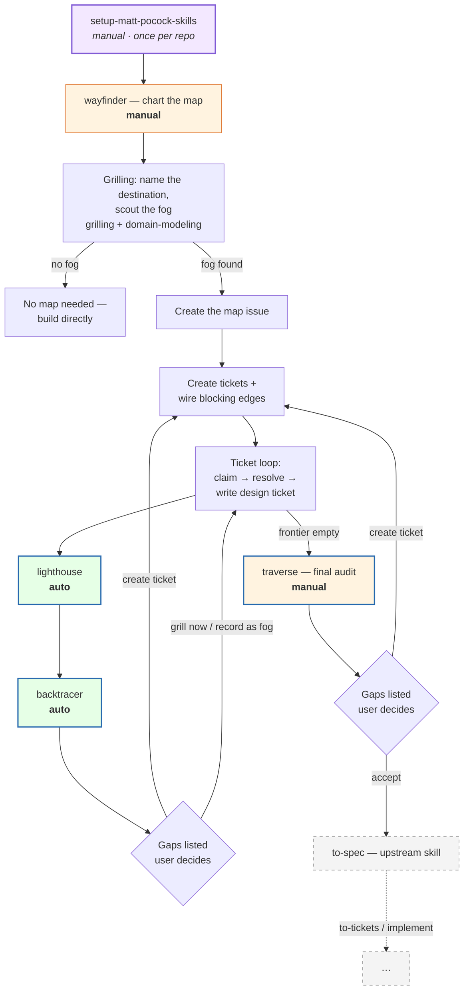
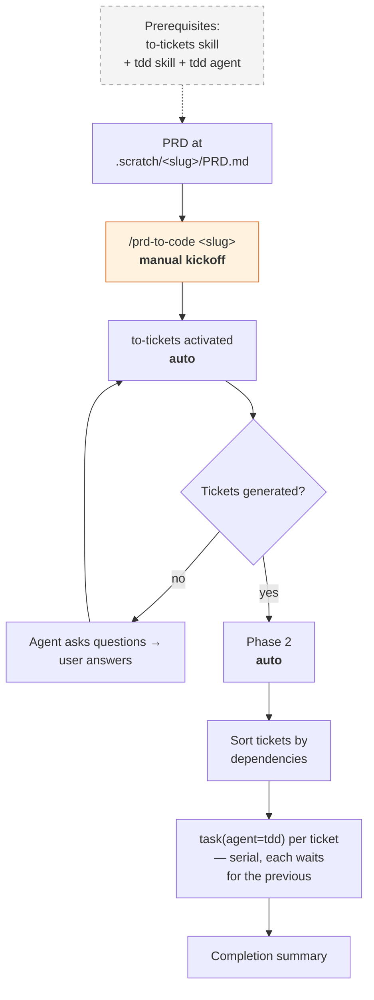

# Oh My Wayfinder

[中文文档](./README.cn.md)

A fork of **[mattpocock/skills](https://github.com/mattpocock/skills)** — the engineering skills for AI agents — extended with new planning-quality skills and an automation extension for the **[Oh My Pi](https://github.com/can1357/oh-my-pi)** agent.

This repository contains **only what differs from upstream**. Install Matt's skills first, then overlay this repo's files on top (see [Quick Start](#quick-start)).

## Quick Start

> Make sure you understand the wayfinder flow before you start — it is the core this repo builds on (see [Flow A](#flow-a--the-wayfinder-planning-pipeline)).

This repo is a delta on top of Matt's set, so: install upstream first, then overlay.

1. Install Matt's skills: `npx skills@latest add mattpocock/skills`.
2. Copy this repo's `skills/` directory over the installed skill directory — files with the same name replace upstream's, the rest are plain additions.
3. Oh My Pi users: copy `extensions/prd-to-code.ts` and `extensions/agents/tdd.md` into your extension setup (the extension finds the `tdd` agent next to itself).

Then run `/setup-matt-pocock-skills` once per repo, as with the upstream set.

## What's inside

**Part 1 — Generic skills** (agent-agnostic; work with any agent that loads markdown skills)

The planning loop they drive: `wayfinder` charts an effort too big for one session as a map of decision tickets on your issue tracker; every resolved ticket is captured in a **lighthouse** document; **backtracer** traces signals across the map to surface gaps; **traverse** audits the completed map end to end before it hands off to `to-spec`.

**Part 2 — [Oh My Pi](https://github.com/can1357/oh-my-pi) automation extension** (`@oh-my-pi/pi-coding-agent` only)

`/prd-to-code` turns a PRD spec into task tickets and executes them with serial TDD subagents — one command, fully automatic. Irrelevant if you use another agent; ignore it.

## What's new compared to upstream

| Skill | Type | What it does | When it runs | Trigger |
|---|---|---|---|---|
| `lighthouse` | **New** | Produces a lighthouse document from a resolved wayfinder ticket: the decision, user stories, preconditions, postconditions, invariants — the single source of truth backtracer traces | Immediately after a wayfinder ticket is resolved | **Auto** (invoked by wayfinder) |
| `backtracer` | **New** | Traces "so that" clauses, invariants, and dependencies from tickets and lighthouse documents across the whole map — surfacing missing tickets, layer gaps, and asymmetry before they become bugs | Immediately after lighthouse, once per resolved ticket | **Auto** (invoked by wayfinder) |
| `traverse` | **New** | Final audit of a completed map: builds the design tree and walks every branch — dependency coverage, peer symmetry, layer integrity, boundary completeness | After all wayfinder tickets are resolved, before to-spec | **Manual** |
| `wayfinder` | **Modified** | Upstream skill, reworked: mandates lighthouse + backtracer after every resolved ticket, separates design tickets (`.scratch/<feature>/design/`) from task tickets (`issues/`), routes gap decisions through the user | When an effort is too big for one agent session | **Manual** |
| `setup-matt-pocock-skills` | **Modified** | Upstream setup skill, lightly adapted (tracker options, triage labels, domain-doc layout) | Once per repo, before first use | **Manual** |
| `prd-to-code` + `tdd` agent | **Extension** (OMP only) | PRD → task tickets → serial TDD subagents, fully automatic after one command | When you have a spec you want implemented | **Manual kickoff**, then automatic |

"Auto" means the calling skill mandates the step as part of its flow — an instruction-level guarantee, not a separate scheduler.

## Flow A — the wayfinder planning pipeline

- Only two manual triggers in the whole pipeline: `wayfinder` itself and `traverse` (the final audit).
- `lighthouse` and `backtracer` are invoked automatically by wayfinder after every resolved ticket.
- After `backtracer` (per ticket) and after `traverse` (at the end), the skill lists the gaps it found. The skill files do not dictate how to handle them — the user decides. Suggested ways: create a new ticket, settle the gap with a grilling session right in the current conversation, or record it as fog in the map's **Not yet specified**.
- The pipeline hands off to upstream `to-spec`. Everything after that — `to-tickets`, `implement` — ships in mattpocock/skills, not here.

Legend: blue outline = new skills in this repo · green = auto-invoked · orange = manual trigger · purple = one-time setup · gray dashed = upstream / beyond this repo.

## Flow B — PRD to code (Oh My Pi only)

Run `/prd-to-code <slug>` with the PRD at `.scratch/<slug>/PRD.md`. That single command is the only manual step — everything after it runs automatically.

The `tdd` agent (`extensions/agents/tdd.md`) is the only piece this repo adds to this loop — the `to-tickets` and `tdd` skills themselves are upstream. The extension fails fast if any prerequisite is missing.

## Thanks

The core of this repository is **[mattpocock/skills](https://github.com/mattpocock/skills)** — thanks to Matt Pocock for building it and releasing it under MIT, and for the [skills.sh](https://skills.sh/mattpocock/skills) installer and the [newsletter](https://www.aihero.dev/s/skills-newsletter) that keep the ecosystem alive. Thanks also to the [Oh My Pi](https://github.com/can1357/oh-my-pi) project — the agent harness this extension targets.

## License

MIT — see [LICENSE](./LICENSE). Upstream copyright retained verbatim: *Copyright (c) 2026 Matt Pocock*.
